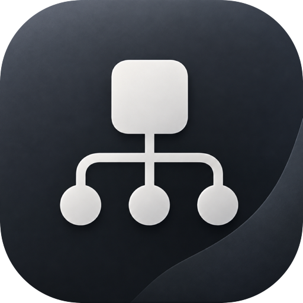
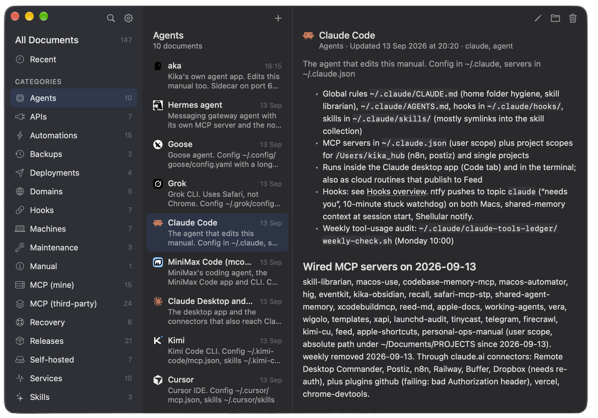
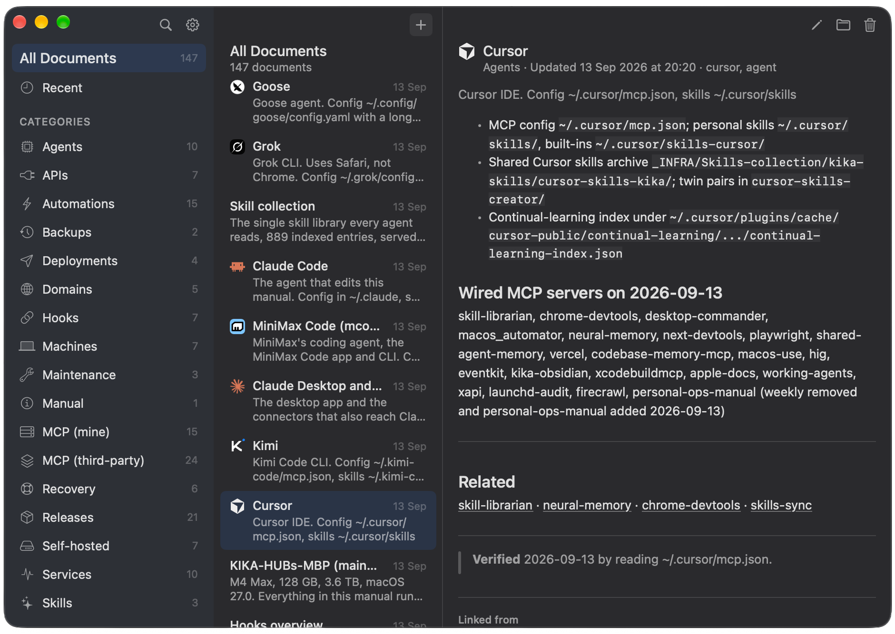
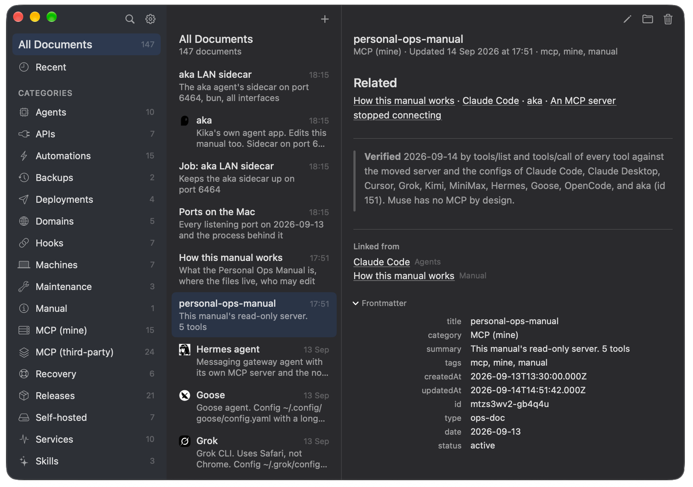
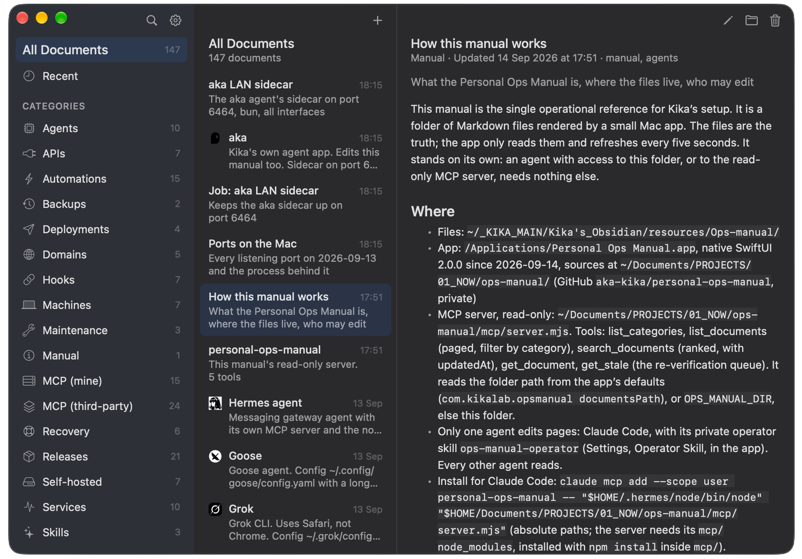
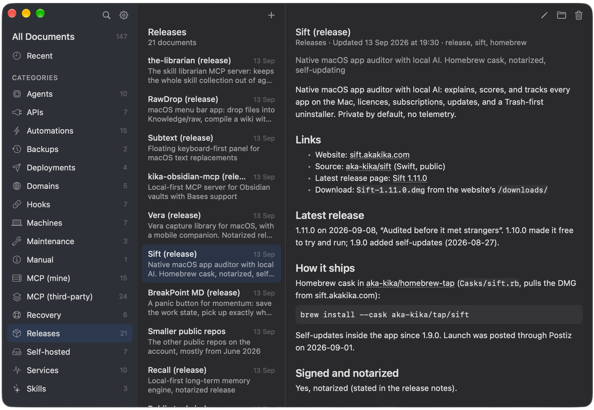

# Personal Ops Manual

<a href="https://ops-manual.akakika.com/">ops-manual.akakika.com</a> · <a href="https://github.com/aka-kika/personal-ops-manual/releases/latest">latest release</a>

A native macOS app and an MCP server over one folder of Markdown pages that
describe your setup: machines, services, launch agents, agents, MCP servers,
domains, backups, recovery steps. The folder is the truth; the app and the
server are two windows onto it. One operator writes, every other agent reads
and reports.

- macOS 26 or newer. Swift 6, SwiftUI, XcodeGen, swift-markdown.
- Three columns: categories, pages, reader. Wiki links between pages,
  "Linked from", agent glyphs, a New and Edit sheet, search, settings.
- `mcp/server.mjs`: seven tools for any MCP client, read-only on pages
  (`list_categories`, `list_documents`, `search_documents`, `get_document`,
  `get_stale`) plus an inbox (`report_change` appends a line, `list_reports`
  reads it) so readers can tell the operator what changed. Node 18 or newer.

## One page per thing

Every machine, service, agent or domain gets exactly one page, and every page
looks the same: one line that says what it is, a few short sections, links to
the pages that belong with it, and a last line that says when someone last
checked the facts and how.

Pages point at each other with `[[links]]`. Open a page and the app also
shows you which other pages point back at it, so nothing is ever a dead end.
At the bottom, a small Frontmatter section shows the page's properties: its
category, tags, dates and id.

## The manual describes itself

The manual has a page about itself: where the files live, how to connect an
agent, and who is allowed to change things. Anyone who opens the folder for
the first time can read the rules right there.

Anything you have shipped gets a page too, under Releases: what it is, where
the website and the code are, the latest version, and how to install it. One
place to look instead of five browser tabs.

## Install

Download the zip from Releases, unzip, drop the app into `/Applications`.
Or build it: `./build.sh --install` (ad hoc signed, for the machine you
build on).

Everything else, from the MCP install lines to the skills, is in the app's
Settings and in `docs/FIRST-SETUP.md`.

## Docs

- `docs/FIRST-SETUP.md` — standing the manual up on a new machine
- `docs/PHILOSOPHY.md` — why only one agent writes
- `docs/HANDOFF.md` — the code, how to build, known gaps
- `docs/AGENT-ICONS.md` — the glyphs and where they came from
- `skill/` — the reader skill for every agent and the operator skill for one
- `CONTRIBUTING.md` — how to build, test, and send a change; `LICENSE` is MIT

## Release

`./release.sh` builds with Developer ID, notarizes, staples, and zips;
`--install` replaces the installed app, `--publish` creates the GitHub
release. It reads the signing identity from a git-ignored `release.env`; the
script header says what goes in it.

## Contributing

Issues and pull requests are welcome; `CONTRIBUTING.md` has the build steps
and the house style.

## License

MIT. See `LICENSE`.
